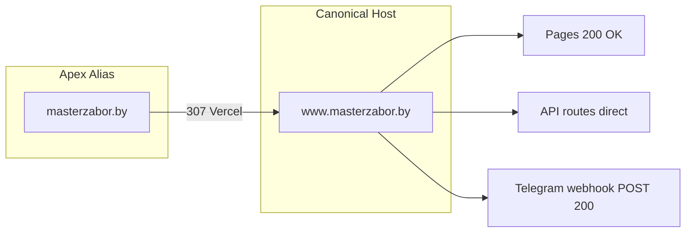
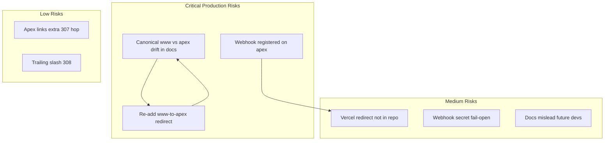
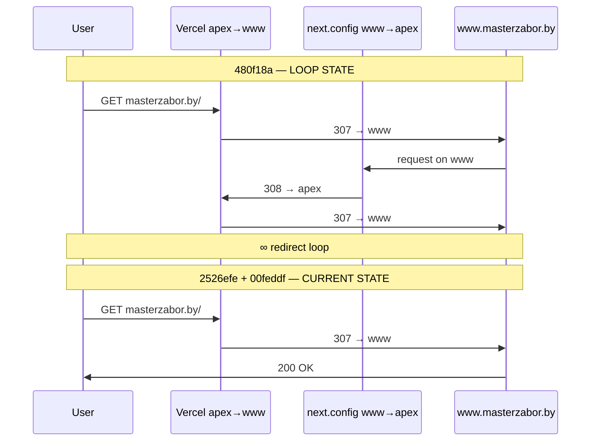
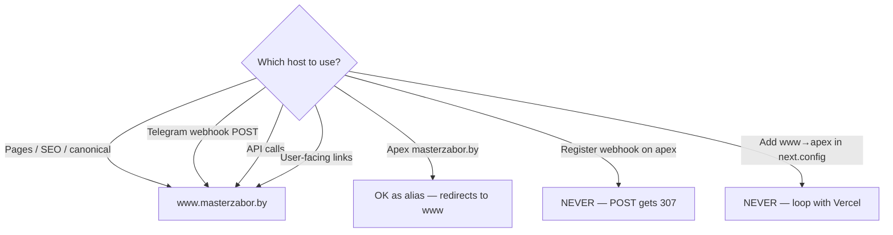

# Production Host/Domain Architecture Audit — masterzabor.by

**Дата аудита:** 26 мая 2026  
**Режим:** read-only (feature-dev Discovery + code-reviewer Spec Compliance)  
**Проверено:** live HTTP, код, git history, docs  
**Код не изменялся**

---

## Executive Summary

**Реальный source of truth сейчас — `www.masterzabor.by`.**

Production работает как **www-primary**:

| Layer | Behavior |
|-------|----------|
| **Vercel (platform)** | `masterzabor.by` → **307** → `www.masterzabor.by` (все пути, включая `/api/*`) |
| **next.config.ts** | Пустой — **нет** custom redirect |
| **Application SEO** | `SITE_URL` = `https://www.masterzabor.by` — canonical, sitemap, robots, OG, JSON-LD |
| **Telegram webhook** | Зарегистрирован на **www**, POST → **200** без redirect |

**Incident root cause (подтверждено git):** конфликт Vercel `apex→www` + custom `www→apex` в `next.config.ts` (commit `480f18a`, 3 мин до hotfix `2526efe`). Hotfix удалил custom redirect; commit `00feddf` перевёл SEO constants на www.

**Docs drift:** `docs/ANALYTICS.md`, `docs/PROGRESS.md`, `.cursorrules` всё ещё описывают **apex-canonical** и redirect rule в `next.config.ts`, которых **в production больше нет**.

---

## 1. Runtime / HTTP Behavior

Проверено через `curl.exe` с `--max-redirs 0` (первый hop) и `-L` (полная цепочка).

### `https://masterzabor.by/`

| Metric | Value |
|--------|-------|
| **1st hop status** | **307 Temporary Redirect** |
| **Location** | `https://www.masterzabor.by/` |
| **Redirect chain** | `masterzabor.by/` → `www.masterzabor.by/` |
| **307/308?** | Да — **307** на первом hop |
| **Final URL** (follow redirects) | `https://www.masterzabor.by/` |
| **Final status** | **200 OK** |
| **Redirects count** | 1 |
| **Direct response?** | Нет — apex не отдаёт HTML напрямую |

### `https://www.masterzabor.by/`

| Metric | Value |
|--------|-------|
| **1st hop status** | **200 OK** |
| **Redirect chain** | — (нет) |
| **307/308?** | Нет |
| **Final URL** | `https://www.masterzabor.by/` |
| **Direct response?** | **Да** |

**HTML meta (production):**

- `<link rel="canonical" href="https://www.masterzabor.by">`
- `<meta property="og:url" content="https://www.masterzabor.by">`

---

### `https://masterzabor.by/api/telegram-webhook`

| Method | 1st hop | Location | Direct? |
|--------|---------|----------|---------|
| **GET** | **307** | `https://www.masterzabor.by/api/telegram-webhook` | Нет |
| **POST** | **307** | `https://www.masterzabor.by/api/telegram-webhook` | **Нет — критично для Telegram** |

Telegram POST на apex **не получает** ответ приложения — только redirect.

---

### `https://www.masterzabor.by/api/telegram-webhook`

| Method | Status | Direct? | Notes |
|--------|--------|---------|-------|
| **GET** | **405 Method Not Allowed** | **Да** | Route exists, только POST |
| **POST** | **200 OK** | **Да** | `Content-Type: application/json`, `X-Matched-Path: /api/telegram-webhook` |

**Webhook safe host: только www.**

---

### Дополнительные проверки (контекст)

| URL | Apex | WWW |
|-----|------|-----|
| `/gomel/` | 307 → www, final 200 (2 hops: host + trailing slash) | 308 → `/gomel` then 200 |
| `/api/lead` POST | **307 → www** | **400** direct (validation, route works) |
| `/api/cron/daily-report` GET | **307 → www** | **401** direct (`CRON_SECRET` set) |
| `/robots.txt`, `/sitemap.xml` | **307 → www** | **200** direct |
| Production robots | — | `Host: www.masterzabor.by`, `Sitemap: https://www.masterzabor.by/sitemap.xml` |
| Production sitemap | — | All `<loc>` = `https://www.masterzabor.by/...` |

---

## 2. Redirect Architecture

### Что есть в репозитории

| Mechanism | Status |
|-----------|--------|
| `next.config.ts` | **Empty** — no `redirects()`, `rewrites()`, `headers()` |
| `middleware.ts` | **Not found** |
| `vercel.json` | Only crons — **no redirects** |
| Host-based rules in app code | **None** |

```typescript
// next.config.ts (текущее состояние)
import type { NextConfig } from "next";

const nextConfig: NextConfig = {};

export default nextConfig;
```

### Что реально работает в production

**Единственный host-redirect — Vercel platform/DNS:**

```
masterzabor.by/*  ──307──►  www.masterzabor.by/*
```

- Server: `Vercel`
- Applies to **all paths** including `/api/*`
- **Not codified** in repo — lives in Vercel Domain Settings

### История incident (git)

| Commit | Date | Action |
|--------|------|--------|
| `480f18a` | 23.05.2026 11:44 | Added `www→apex` redirect in `next.config.ts` (API excluded via regex) |
| `2526efe` | 23.05.2026 11:47 | **Hotfix:** removed entire redirect — "redirect loop on Vercel" |
| `00feddf` | 23.05.2026 12:02 | `SITE_URL`/`SITE_HOST` → www for SEO consistency |

**Loop mechanism (past):**

```
Browser → apex
  → Vercel 307 → www
  → next.config 308 → apex
  → Vercel 307 → www
  → … ∞
```

### Текущий риск loop

| Condition | Loop risk |
|-----------|-----------|
| **Current state** (Vercel apex→www, empty next.config) | **None** — stable |
| Re-add `www→apex` without removing Vercel apex→www | **HIGH — loop returns** |
| Change Vercel primary to apex while keeping www→apex in code | **HIGH** |

### Trailing slash (not host-related)

`https://www.masterzabor.by/gomel/` → **308** → `/gomel` (Next.js trailing slash normalization). Final host remains www.

---

## 3. Telegram Webhook Audit

### Definition & registration

| Item | Location | Value |
|------|----------|-------|
| `TELEGRAM_WEBHOOK_URL` | `lib/constants.ts:8-9` | `https://www.masterzabor.by/api/telegram-webhook` |
| `setWebhook` call | `scripts/set-telegram-bot.ts:38-40` | Uses `TELEGRAM_WEBHOOK_URL` from constants |
| Route handler | `app/api/telegram-webhook/route.ts` | POST only |
| Secret env | `TELEGRAM_WEBHOOK_SECRET` | Header `x-telegram-bot-api-secret-token` |
| Chat lock | `TELEGRAM_CHAT_ID` | Optional allowlist |

```typescript
// lib/constants.ts
/** Telegram POST не следует за 307; на Vercel apex → www, поэтому webhook только на www. */
export const TELEGRAM_WEBHOOK_URL =
  "https://www.masterzabor.by/api/telegram-webhook";
```

### Production behavior

| Question | Answer |
|----------|--------|
| Webhook host | **www** |
| Redirect on webhook URL? | **No** on www; **Yes (307)** on apex |
| Telegram POST safe? | **Yes**, if registered on **www** |
| Telegram POST on apex? | **Broken** — 307, Telegram typically won't follow POST |

**Note:** `getWebhookInfo` не вызывался (нет доступа к `TELEGRAM_BOT_TOKEN`). По constants + script + live POST 200 на www — webhook **должен** быть на www.

### Webhook vs other API routes

| Endpoint | www | apex |
|----------|-----|------|
| `/api/telegram-webhook` POST | 200 direct | 307 → www |
| `/api/lead` POST | 400 direct | 307 → www |
| `/api/cron/*` GET | 401 direct | 307 → www |

Vercel Cron hits relative paths on deployment — typically works. Apex cron URL would 307 first (Vercel cron likely uses primary domain internally).

---

## 4. SEO / Domain Architecture Audit

All derived from `SITE_URL` / `SITE_HOST` in `lib/constants.ts`:

```typescript
export const SITE_URL = "https://www.masterzabor.by";
export const SITE_HOST = "www.masterzabor.by";
```

| System | Host used | Source | Production verified |
|--------|-----------|--------|---------------------|
| **SITE_URL** | **www** | `lib/constants.ts:3` | — |
| **SITE_HOST** | **www** | `lib/constants.ts:4` | — |
| **metadataBase** | **www** | `lib/seo.ts:70` → `new URL(SITE_URL)` | — |
| **Canonical** | **www** | `lib/seo.ts:71-72` → `alternates.canonical` | ✅ homepage, `/gomel/` |
| **OpenGraph url** | **www** | `lib/seo.ts:115` | ✅ |
| **Twitter images** | **www** (absolute via `absoluteUrl()`) | `lib/seo.ts:129` | — |
| **Sitemap URLs** | **www** | `app/sitemap.ts` + `SITE_URL` | ✅ live sitemap |
| **Robots Host** | **www** | `app/robots.ts:12` → `SITE_HOST` | ✅ live robots |
| **Robots Sitemap** | **www** | `app/robots.ts:11` | ✅ |
| **JSON-LD LocalBusiness url** | **www** | `lib/seo.ts:138-140` | — |
| **JSON-LD Organization url** | **www** | `lib/seo.ts:169-171` | — |
| **JSON-LD WebSite url** | **www** | `lib/seo.ts:190-191` | — |
| **JSON-LD Breadcrumb item** | **www** | `lib/seo.ts:253` → `absoluteUrl()` | — |
| **JSON-LD Article mainEntityOfPage** | **www** | `lib/seo.ts:271` | — |
| **City LocalBusiness @id** | **www** | `CityPage.tsx:84-86` | — |
| **OG image absolute URL** | **www** | `lib/seo.ts:54,65` | — |

**Consistency:** Application SEO stack is **100% www-aligned** and matches live production HTML/sitemap/robots.

### Docs vs reality (drift)

| Document | Says | Reality |
|----------|------|---------|
| `.cursorrules:23` | `https://masterzabor.by` | Code + production = **www** |
| `docs/PLAN.MD.md` | `SITE_URL ("https://masterzabor.by")` | Outdated |
| `docs/ANALYTICS.md:52-66` | Apex canonical + `www→apex` in next.config | **Neither exists** in production |
| `docs/PROGRESS.md:243-266` | Apex canonical + next.config redirect | **Stale** — removed May 23 |

---

## 5. Environment / Config Audit

### Domain-related values in repo

| Variable / Constant | Value | Host | Used for |
|---------------------|-------|------|----------|
| `SITE_URL` | `https://www.masterzabor.by` | www | SEO, sitemap, JSON-LD, canonical |
| `SITE_HOST` | `www.masterzabor.by` | www | robots Host |
| `TELEGRAM_WEBHOOK_URL` | `https://www.masterzabor.by/api/telegram-webhook` | www | setWebhook script |
| `.cursorrules` Домен | `https://masterzabor.by` | apex | **Conflict — docs only** |
| `NEXT_PUBLIC_YM_ID` | env | N/A | Analytics script |
| `NEXT_PUBLIC_GA_ID` | env | N/A | Analytics script |

**No `SITE_URL` env override** — hardcoded in `lib/constants.ts`.

`.env.example` documents webhook URL as www (lines 57-58). No domain env vars.

### Conflicting values

| Conflict | Severity |
|----------|----------|
| `.cursorrules` / PLAN / ANALYTICS say apex | **Documentation only** — misleads future changes |
| Past `480f18a`: code apex + redirect vs Vercel www | **Resolved** by `00feddf` + hotfix |
| PROGRESS "robots Host = masterzabor.by (apex)" | **Stale** — production shows `www` |

---

## 6. Risk Analysis

### Mixed-host architecture?

**Historically yes, currently no** in application layer. Runtime is **www-primary** with apex as entry alias (307 only).

Residual mixed signals only in **documentation** and user bookmarks/links to apex.

### SEO risks

| Risk | Level | Detail |
|------|-------|--------|
| Duplicate mirror indexing | **Low** | Apex 307→www; canonical/sitemap/robots all www |
| Re-add www→apex redirect | **Critical** | Loop + broken site |
| Docs say apex → dev re-adds redirect | **Medium** | Operational |
| Yandex `Host:` directive | **Low** | Production `www` — consistent with sitemap |
| Google canonical | **Low** | Verified www in HTML |

### Telegram webhook risks

| Risk | Level | Detail |
|------|-------|--------|
| Webhook registered on apex | **Critical** | POST gets 307, delivery fails |
| Re-add www→apex even with API exclusion | **Low-Medium** | API exclusion worked in `480f18a`, but loop still broke pages |
| Wrong `TELEGRAM_WEBHOOK_SECRET` | **Medium** | Silent `{ ok: true }` — hard to debug |
| Vercel changes primary domain to apex | **High** | Would need webhook URL review |

### Redirect risks

| Risk | Level |
|------|-------|
| Current config stable | ✅ Safe |
| Undocumented Vercel apex→www + hidden dashboard changes | Medium |
| next.config redirect not in repo | Medium — behavior depends on Vercel dashboard |

### Future migration risks

| Migration | Risk |
|-----------|------|
| Move canonical to apex | Must **remove** Vercel apex→www first; update all constants; re-register webhook |
| Add www→apex in next.config | **Never** without removing Vercel apex→www |
| Change webhook to apex | **Never** while Vercel redirects apex→www |
| Codify redirects in next.config | Good for reproducibility — but only one direction |

---

## 7. Final Summary Table

| System | Current Host | Notes |
|--------|--------------|-------|
| **Runtime (pages)** | **www** | Apex → 307 → www; www serves 200 |
| **Runtime (API)** | **www** | Apex `/api/*` → 307 → www; app responds on www |
| **Redirects (Vercel)** | **apex → www (307)** | Platform-level, not in repo |
| **Redirects (app)** | **None** | `next.config.ts` empty since hotfix `2526efe` |
| **Canonical** | **www** | Verified in production HTML |
| **Sitemap** | **www** | All 55+ URLs `https://www.masterzabor.by/...` |
| **Robots Host** | **www** | `Host: www.masterzabor.by` |
| **OpenGraph** | **www** | `og:url` = www |
| **JSON-LD** | **www** | All `@id`, `url` via `SITE_URL` |
| **Telegram Webhook** | **www** | POST 200 direct; apex POST → 307 (unsafe) |

---

## Real Source of Truth

```
┌─────────────────────────────────────────────────────────┐
│  SOURCE OF TRUTH: www.masterzabor.by                    │
│                                                         │
│  Vercel DNS:  apex ──307──► www  (alias, not canonical) │
│  App code:    SITE_URL = https://www.masterzabor.by     │
│  SEO:         canonical, sitemap, robots, JSON-LD = www │
│  Telegram:    webhook URL = www only                    │
└─────────────────────────────────────────────────────────┘
```

**Strategy in production:** **www-primary unified architecture** (since commits `2526efe` + `00feddf`, 23.05.2026).

Apex is **redirect alias only**, not canonical, not webhook host.

---

## Architecture Diagrams

### Current production flow (stable)



### Risk register



### Incident timeline (May 23, 2026)



### Host decision matrix



---

## Safest Production Setup

**Current production is already the safe configuration** after the hotfix:

1. **Vercel:** keep `masterzabor.by` redirecting to `www.masterzabor.by` (or set www as primary).
2. **next.config.ts:** keep **empty** of host redirects — **do not re-add www→apex**.
3. **Constants:** keep `SITE_URL` / `SITE_HOST` on **www** (already done).
4. **Telegram:** webhook only on `https://www.masterzabor.by/api/telegram-webhook`.
5. **Cron/API:** call on www (or accept apex 307 hop for non-Telegram clients that follow redirects).

**Optional hardening (future):**

- Update `docs/ANALYTICS.md`, `.cursorrules`, `PROGRESS.md` to reflect www-primary.
- Document Vercel redirect behavior explicitly (platform-level, not in repo).
- Never register Telegram webhook on apex.

---

## What NOT to Touch

| Item | Reason |
|------|--------|
| **Empty `next.config.ts`** (no www→apex) | Re-adding caused production loop |
| **`TELEGRAM_WEBHOOK_URL` on www** | Apex POST gets 307 |
| **`SITE_URL` = www** | Matches runtime + live canonical |
| **Vercel apex→www redirect** | Removing without coordinated migration breaks current model |

---

## What CAN Be Safely Changed

| Item | Safe? | Notes |
|------|-------|-------|
| Update docs to www-primary | ✅ | No runtime impact |
| `.cursorrules` domain line | ✅ | Documentation only |
| Inner page content, forms, SEO text | ✅ | No host impact |
| `CRON_SECRET`, analytics env | ✅ | Independent of host |
| Trailing slash behavior | ⚠️ | Test per-route; not host-related |

---

## What Is Risky Right Now

| Item | Risk |
|------|------|
| **`docs/ANALYTICS.md` describes apex canonical + next.config redirect** | Dev may re-introduce loop |
| **`.cursorrules` says apex domain** | Same |
| **`docs/PROGRESS.md` Redirect section** | Describes removed config as current |
| **Telegram webhook on apex URL** | POST redirect failure |
| **Re-adding www→apex in next.config** | **Redirect loop** with Vercel |
| **Vercel dashboard domain changes without audit** | Silent breakage of webhook/SEO |

---

## Appendix: General Project Audit (prior session)

Краткая сводка более широкого аудита проекта (промпты 1–11, spec compliance, code quality).

### Spec compliance highlights

| Area | Status |
|------|--------|
| 40 city pages | ✅ |
| 6 service pages | ✅ |
| Business forbidden phrases | ✅ |
| Phone +375 validation | ✅ |
| Header missing «Цены» | ❌ |
| LeadForm subtitle / comment placeholder | ⚠️ |
| `/blog/` BreadcrumbList JSON-LD | ❌ |
| PROGRESS.md drift | ⚠️ |

### Code quality highlights

| Issue | Severity |
|-------|----------|
| Cron without mandatory CRON_SECRET | Critical (if env unset) |
| In-memory rate limiting on serverless | Major |
| Webhook secret fail-open | Major |
| No automated tests | Major |
| Fake SearchAction JSON-LD | Minor |

### Verdict (general audit)

**Request Changes** — core lead-gen functional; production-hardening and doc sync needed before scaling traffic.

---

## Related files

| File | Role |
|------|------|
| `lib/constants.ts` | `SITE_URL`, `SITE_HOST`, `TELEGRAM_WEBHOOK_URL` |
| `next.config.ts` | Redirect config (currently empty) |
| `vercel.json` | Cron schedule only |
| `lib/seo.ts` | metadataBase, canonical, JSON-LD |
| `app/sitemap.ts` | Sitemap URLs |
| `app/robots.ts` | Robots Host + sitemap |
| `scripts/set-telegram-bot.ts` | Telegram setWebhook |
| `app/api/telegram-webhook/route.ts` | Webhook handler |
| `docs/ANALYTICS.md` | Analytics + webhook docs (partially stale) |
| `docs/PROGRESS.md` | Progress log (partially stale on host topic) |

---

*Документ создан автоматически по результатам аудита 26.05.2026. Не изменяет production configuration.*

*Документация синхронизирована 26.05.2026: `.cursorrules`, `docs/ANALYTICS.md`, `docs/PROGRESS.md`, `docs/PLAN.MD.md`.*
